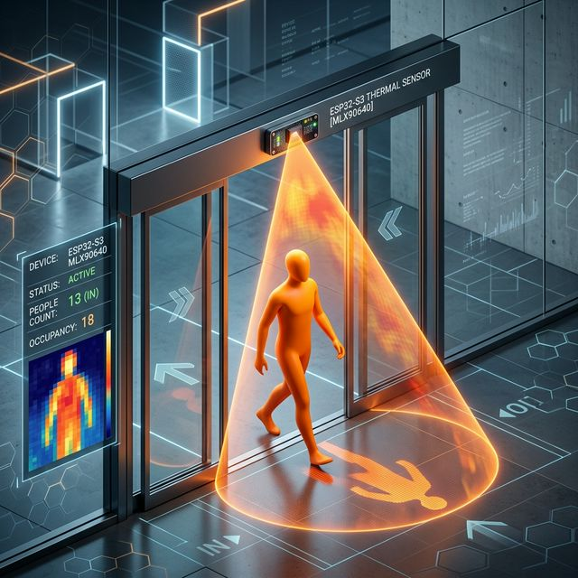
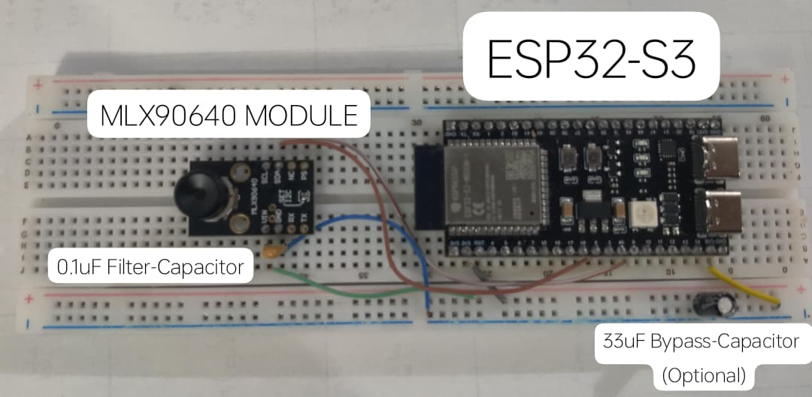
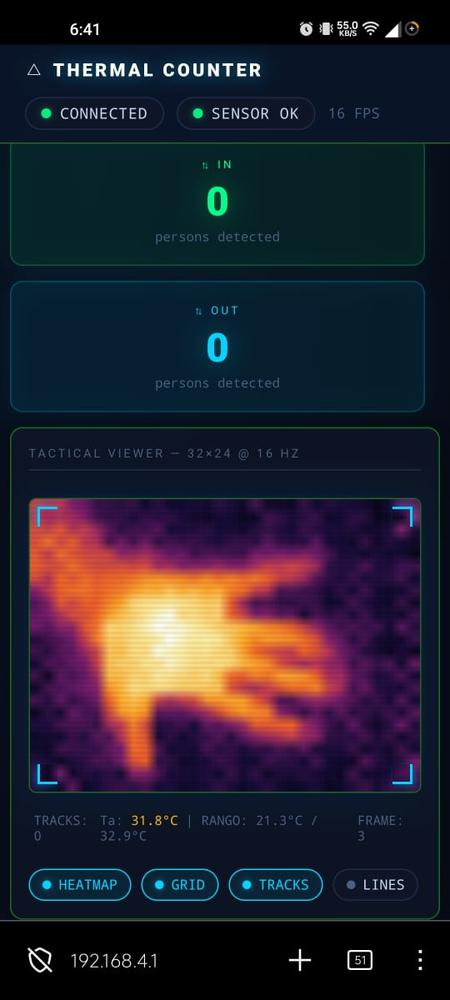
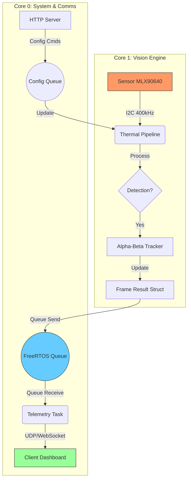

# 🛰️ Thermal Door Detector · Edge AI HUD

[Leer en Español](README_ES.md)

[Leer en Español](README_ES.md)

### 📸 System Overview

#### Hardware Setup

#### Web HUD Interface

---

## 📽️ Demonstration Videos

Experience the system in action through these field tests:

- **[Extended Prototype Demonstration](docs/assets/demo-extended.mp4)**: Full walkthrough of the system, from boot to real-time counting.
- **[Multiple People Detection Test](docs/assets/demo-multiple-people.mp4)**: Stress test showing the Alpha-Beta tracker handling multiple overlapping targets.

---

- **Total Privacy:** No faces or identifiable features are captured.
- **Light Immunity:** Operates in total darkness or direct sunlight.
- **Biometric Detection:** Based on the human thermal signature. It detects superficial skin temperatures (typically between 28°C and 37°C), allowing it to differentiate human targets from inanimate objects and background noise.
- **Versatile Visualization:** Beyond person counting, it can be used as a **standard thermal camera** for real-time monitoring through the web interface.
- **Triple-Vision Modes:** The HUD supports 3 distinct modes (Raw, Background, and Radar) for deep system diagnostics.

---

## 📖 Index
1. [Overview](#overview)
2. [Architectural Foundation](#architectural-foundation)
3. [High-Level Architecture](#high-level-architecture)
4. [The Vision Pipeline (Algorithm)](#the-vision-pipeline-algorithm)
5. [Tactical HUD Interface](#tactical-hud-interface)
6. [Calibration Guide (with visual examples)](#calibration-guide)
7. [Technical Specifications](#technical-specifications)
8. [Installation and Deployment](#installation-and-deployment)
9. [OTA Updates (with visual examples)](#ota-updates-over-the-air)

---

## 🛡️ Overview

Unlike conventional cameras, this system uses a **32x24 thermopile array**. Each pixel is a real temperature measurement. This data nature ensures:
- **Total Privacy:** No faces or identifiable features are captured.
- **Light Immunity:** Operates in total darkness or direct sunlight.
- **Biometric Detection:** Based on the human thermal signature (~30-36°C), differentiating it from inanimate objects.

---

## 🏗️ Architectural Foundation

The system exploits the **Dual-Core** architecture of the ESP32-S3 through an asymmetric task division using **FreeRTOS**:

### Core 1: The Vision Engine (`ThermalPipe`)
The highest priority core. It executes the mathematical processing loop at **16 Hz**.
- **Determinism:** Uses `vTaskDelayUntil` to ensure accurate sensor sampling.
- **I2C Security (400kHz):** Configured to Fast Mode to guarantee data integrity and avoid EEPROM corruption from electrical noise.
- **Isolation:** Does not perform heavy network tasks to avoid interference in the data bus.
- **Static Memory:** All image buffers are statically pre-allocated to avoid heap fragmentation.

### Core 0: Communications and Telemetry (`TelemetryTask`)
Manages the system's external layer.
- **SoftAP & Web Server:** Handles a WiFi access point and serves the tactical Dashboard.
- **Binary WebSockets:** Packages processed data into C `packed` structures for efficient transmission.
- **NVS Flash:** Manages calibration persistence so settings survive power outages.

---

## 🏗️ High-Level Architecture

The system is designed under an **Asynchronous Producer-Consumer** model, optimizing the use of the ESP32-S3's two cores.

### Technical Ecosystem
- **FreeRTOS Static Allocation:** All objects (`Task`, `Queue`, `Semaphore`) are created using static memory to ensure the system never fails due to heap exhaustion.
- **Zero-Copy Intent:** Pointers and `packed` structures are used to minimize data copying between the vision pipeline and the network layer.
- **Integrated Watchdog:** The system monitors the health of both tasks; if the pipeline stalls due to an I2C bus error, the system automatically restarts to recover service.

---

## 🧠 The Vision Pipeline (Algorithm)

Processing is divided into 5 sequential stages that transform thermal noise into counting events:

### 1. Pre-processing and "De-Chess" Filter
### 1. Selective EMA Background Modeling
Maintains a dynamic model of the environment's base temperature.
- **Adaptive Learning**: Automatically ignores pixels identified as "Person Tracks" to prevent targets from being absorbed into the background.

### 2. Peak Detection (Thermal Topology)
Analyzes the difference between the live frame and the background model.
- Identifies local maximums that exceed the biological temperature threshold (~30°C).

### 3. Non-Maximum Suppression (NMS)
Filters redundant detections. Since a person occupies multiple pixels, NMS ensures each human heat signature is represented by a single centroid.

### 4. Alpha-Beta Tracking with Identity Verification
Implements a predictive filter to follow people between frames.
- **Anti-Stealing (Alpha 0.6):** Ensures each heat "peak" is assigned to a single track, preventing nearby people from stealing their neighbor's identity.
- Calculates the velocity vector `(vx, vy)`.
- Manages track "life": if a person disappears for 5 frames, the system removes them to avoid ghost generation.

### 5. Intent Inference & Crossing Logic
Defines two virtual `Y` lines. Counting triggers when a track ID crosses both lines.
- **Intent Inference (Alpha 0.6):** If a person is first detected in the middle (neutral) zone, the system uses its **vertical velocity vector** to decide if the line crossing counts as an entry or exit, eliminating failures due to "sudden appearance".

---

## 🖥️ Tactical HUD Interface

The system includes a **Cyberpunk/Tactical HUD** style web interface designed for field engineering:

- **Bilinear Interpolation:** The browser rescales the 32x24 matrix to 640x480 using the GPU, creating a smooth ("blur") image instead of pixelated blocks.
- **Velocity Vectors:** Each tracked person shows a yellow arrow indicating where and how fast they are moving.
- **Radar Mode:** Allows viewing the "thermal residue" (subtracted image). Ideal for debugging if the background is being learned correctly.
- **Thermal Camera Mode:** View the thermal map in real-time with high-speed GPU interpolation for standard surveillance.
- **Ta Telemetry:** Displays the internal silicon temperature to monitor the sensor's thermal stress.

---

## 📽️ Demonstration Videos

Experience the system in action through these field tests:

- **[Extended Prototype Demonstration](docs/assets/demo-extended.mp4)**: Full walkthrough of the system, from boot to real-time counting.
- **[Multiple People Detection Test](docs/assets/demo-multiple-people.mp4)**: Stress test showing the Alpha-Beta tracker handling multiple overlapping targets.

---

## ⚙️ Calibration Guide

The system is highly flexible thanks to parameters accessible via the Web:

| Parameter | Function | When to Adjust |
|-----------|----------|----------------|
| **Biological Temp** | Min Threshold (°C) | If the environment is very hot (>30°C), increase this value. |
| **Background Delta** | Contrast vs Wall | If there is significant thermal shadowing, increase to avoid false positives. |
| **EMA Adaptation** | Learning Speed | Increase if the room temperature changes abruptly (Air Conditioning). |
| **NMS Radius** | "Person" Size | **Crave Data:** Adjust based on ceiling height. High ceilings require smaller radii. |
| **Y Lines** | Activation Zones | Move so they sit right over the door lintel in the view. |

**Recommended Flow:**
1. Adjust parameters for clean detection.
2. Click **APPLY SETTINGS** to test live.
3. Click **SAVE TO FLASH** to make the configuration permanent.

---

## 📊 Technical Specifications

- **Sensor:** Melexis MLX90640 (Thermopile Array).
- **Resolution:** 32 x 24 pixels (768 measurement points).
- **Field of View (FOV):** 110° x 75° (Wide angle).
- **Processing Frequency:** 16 constant FPS.
- **Consumption:** ~120mA (active WiFi + Processing).
- **Accuracy:** ±1.5°C typical.

---

---

## 🛠️ OTA Updates (Over-The-Air)
The system supports wireless firmware updates. No need to connect a USB cable once the sensor is installed.
- **Web Dashboard**: Upload the `.bin` file directly from the "OTA Update" panel.
- **Direct Script**: Use `python scripts/ota_upload.py` to flash remotely from your terminal.

For more details, see the [OTA Flashing Guide](docs/operations/ota_flash.md).

---

## 📂 Project Structure

- **`docs/`**: Detailed technical documentation.
  - `algorithm/`: Mathematical explanation of the vision pipeline.
  - `hardware/`: Connection diagrams and extension designs (SD/RTC).
  - `operations/`: Calibration, deployment, and OTA flashing guides.
- **`.agents/`**: Optimized context for AI assistants (Antigravity).
- **`components/`**: C++ modules (Driver, Pipeline, Telemetry, Web Server).
- **`scripts/`**: Utility tools for development.

---

## 🚀 Installation and Deployment
Full documentation in the [Deployment Guide](docs/operations/deploy.md).

---

> [!IMPORTANT]
> **Industrial Safety:** This device is a person counting and flow analysis system. It should not be used for medical diagnosis or critical safety.

## 📜 License & Credits

-   **Project**: This project is licensed under the **MIT License**.
-   **Melexis Driver**: The MLX90640 driver located in `components/mlx90640_driver/` is property of **Melexis N.V.** and is licensed under the **Apache License, Version 2.0**.
-   **Authors**: Developed for the ESP32-S3 high-efficiency thermal vision solution.

---
