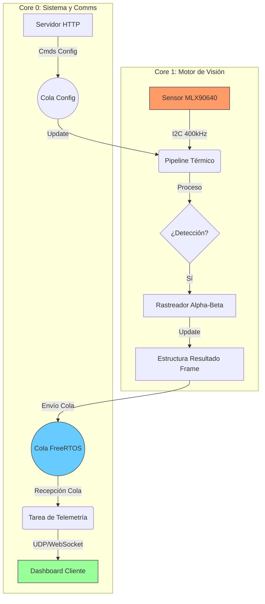

# 🛰️ Detector de Puerta Térmica · Edge AI HUD

[Read this in English](README.md)

Un sistema de visión artificial térmica de alto rendimiento para el conteo de personas, diseñado para el **análisis en el Edge Computing**. Utiliza un sensor Melexis MLX90640 y un microcontrolador ESP32-S3 para procesar imágenes térmicas, rastrear objetivos y gestionar estadísticas sin comprometer la privacidad.

---

## 📖 Índice
1. [Resumen](#resumen)
2. [Fundamentos Arquitectónicos](#fundamentos-arquitectónicos)
3. [Arquitectura de Alto Nivel](#arquitectura-de-alto-nivel)
4. [El Pipeline de Visión (Algoritmo)](#el-pipeline-de-visión-algoritmo)
5. [Interfaz HUD Táctica](#interfaz-hud-táctica)
6. [Guía de Calibración](#guía-de-calibración)
7. [Especificaciones Técnicas](#especificaciones-técnicas)
8. [Instalación y Despliegue](#instalación-y-despliegue)

---

## 🛡️ Resumen

A diferencia de las cámaras convencionales, este sistema utiliza una **matriz de termopilas de 32x24**. Cada píxel es una medición de temperatura real. Esta naturaleza de los datos garantiza:
- **Privacidad Total:** No se capturan rostros ni rasgos identificables.
- **Inmunidad a la Luz:** Funciona en oscuridad total o bajo luz solar directa.
- **Detección Biométrica:** Basada en la firma térmica humana (~30-36°C), diferenciándola de objetos inanimados.

---

## 🏗️ Fundamentos Arquitectónicos

El sistema explota la arquitectura **Dual-Core** del ESP32-S3 mediante una división de tareas asimétrica utilizando **FreeRTOS**:

### Core 1: El Motor de Visión (`ThermalPipe`)
El núcleo de mayor prioridad. Ejecuta el bucle de procesamiento matemático a **16 Hz**.
- **Determinismo:** Utiliza `vTaskDelayUntil` para garantizar un muestreo preciso del sensor.
- **Seguridad I2C (400kHz):** Configurado en Fast Mode para garantizar la integridad de los datos y evitar la corrupción de la EEPROM por ruido eléctrico.
- **Aislamiento:** No realiza tareas pesadas de red para evitar interferencias en el bus de datos.
- **Memoria Estática:** Todos los buffers de imagen están pre-asignados estáticamente para evitar la fragmentación del heap.

### Core 0: Comunicaciones y Telemetría (`TelemetryTask`)
Gestiona la capa externa del sistema.
- **SoftAP y Servidor Web:** Maneja un punto de acceso WiFi y sirve el Dashboard táctico.
- **WebSockets Binarios:** Empaqueta los datos procesados en estructuras `packed` de C para una transmisión eficiente.
- **Flash NVS:** Gestiona la persistencia de la calibración para que los ajustes sobrevivan a cortes de energía.

---

## 🏗️ Arquitectura de Alto Nivel

El sistema está diseñado bajo un modelo **Productor-Consumidor Asíncrono**, optimizando el uso de los dos núcleos del ESP32-S3.

### Ecosistema Técnico
- **Asignación Estática FreeRTOS:** Todos los objetos (`Task`, `Queue`, `Semaphore`) se crean usando memoria estática para asegurar que el sistema nunca falle por agotamiento del heap.
- **Intención Zero-Copy:** Se utilizan punteros y estructuras `packed` para minimizar la copia de datos entre el pipeline de visión y la capa de red.
- **Watchdog Integrado:** El sistema monitorea la salud de ambas tareas; si el pipeline se detiene por un error en el bus I2C, el sistema se reinicia automáticamente para recuperar el servicio.

---

## 🧠 El Pipeline de Visión (Algoritmo)

El procesamiento se divide en 5 etapas secuenciales que transforman el ruido térmico en eventos de conteo:

### 1. Modelado de Fondo EMA Selectivo
Mantiene un modelo dinámico de la temperatura base del entorno.
- **Aprendizaje Adaptativo**: Ignora automáticamente los píxeles identificados como "Rastros de Personas" para evitar que los objetivos sean absorbidos por el fondo.

### 2. Detección de Picos (Topología Térmica)
Analiza la diferencia entre el frame en vivo y el modelo de fondo.
- Identifica máximos locales que superan el umbral de temperatura biológica (~30°C).

### 3. Supresión de No-Máximos (NMS)
Filtra detecciones redundantes. Dado que una persona ocupa varios píxeles, el NMS asegura que cada firma térmica humana esté representada por un único centroide.

### 4. Rastreo Alpha-Beta con Verificación de Identidad
Implementa un filtro predictivo para seguir a las personas entre frames.
- **Anti-Robo (Alpha 0.6):** Asegura que cada "pico" de calor se asigne a un único rastro, evitando que personas cercanas roben la identidad de su vecino.
- Calcula el vector de velocidad `(vx, vy)`.
- Gestiona la "vida" del rastro: si una persona desaparece por 5 frames, el sistema la elimina para evitar la generación de "fantasmas".

### 5. Inferencia de Intención y Lógica de Cruce
Define dos líneas virtuales `Y`. El conteo se dispara cuando un ID de rastro cruza ambas líneas.
- **Inferencia de Intención (Alpha 0.6):** Si una persona es detectada por primera vez en la zona media (neutra), el sistema utiliza su **vector de velocidad vertical** para decidir si el cruce de línea cuenta como entrada o salida, eliminando fallos por "aparición repentina".

---

## 🖥️ Interfaz HUD Táctica

El sistema incluye una interfaz web estilo **HUD Cyberpunk/Táctico** diseñada para ingeniería de campo:

- **Interpolación Bilineal:** El navegador reescala la matriz de 32x24 a 640x480 usando la GPU, creando una imagen suave ("blur") en lugar de bloques pixelados.
- **Vectores de Velocidad:** Cada persona rastreada muestra una flecha amarilla indicando hacia dónde y qué tan rápido se mueve.
- **Modo Radar:** Permite ver el "residuo térmico" (imagen sustraída). Ideal para depurar si el fondo se está aprendiendo correctamente.
- **Telemetría Ta:** Muestra la temperatura interna del silicio para monitorear el estrés térmico del sensor.

---

## ⚙️ Guía de Calibración

El sistema es altamente flexible gracias a parámetros accesibles vía Web:

| Parámetro | Función | Cuándo Ajustar |
|-----------|----------|----------------|
| **Temp Biológica** | Umbral Mín (°C) | Si el ambiente es muy caluroso (>30°C), aumenta este valor. |
| **Delta de Fondo** | Contraste vs Pared | Si hay mucho sombreado térmico, aumenta para evitar falsos positivos. |
| **Adaptación EMA** | Velocidad de Aprendizaje | Aumenta si la temperatura de la sala cambia bruscamente (Aire Acondicionado). |
| **Radio NMS** | Tamaño de "Persona" | **Dato Crítico:** Ajusta según la altura del techo. Techos altos requieren radios más pequeños. |
| **Líneas Y** | Zonas de Activación | Muévelas para que queden justo sobre el dintel de la puerta en la vista. |

**Flujo Recomendado:**
1. Ajusta parámetros para una detección limpia.
2. Haz clic en **APPLY SETTINGS** para probar en vivo.
3. Haz clic en **SAVE TO FLASH** para que la configuración sea permanente.

---

## 📊 Especificaciones Técnicas

- **Sensor:** Melexis MLX90640 (Matriz de Termopilas).
- **Resolución:** 32 x 24 píxeles (768 puntos de medición).
- **Campo de Visión (FOV):** 110° x 75° (Gran angular).
- **Frecuencia de Procesamiento:** 16 FPS constantes.
- **Consumo:** ~120mA (WiFi activo + Procesamiento).
- **Precisión:** ±1.5°C típica.

---

## 🛠️ Actualizaciones OTA (Over-The-Air)
El sistema soporta actualizaciones inalámbricas de firmware. No es necesario conectar un cable USB una vez instalado el sensor.
- **Web Dashboard**: Sube el archivo `.bin` directamente desde el panel "OTA Update".
- **Script Directo**: Usa `python scripts/ota_upload.py` para flashear remotamente desde tu terminal.

Para más detalles, consulta la [Guía de Flasheo OTA](docs/operations/ota_flash.md).

---

## 📂 Estructura del Proyecto

- **`docs/`**: Documentación técnica detallada.
  - `algorithm/`: Explicación matemática del pipeline de visión.
  - `hardware/`: Diagramas de conexión y diseños de extensión (SD/RTC).
  - `operations/`: Guías de calibración, despliegue y flasheo OTA.
- **`.agents/`**: Contexto optimizado para asistentes de IA (Antigravity).
- **`components/`**: Módulos C++ (Driver, Pipeline, Telemetría, Servidor Web).
- **`scripts/`**: Herramientas de utilidad para el desarrollo.

---

## 🚀 Instalación y Despliegue
Documentación completa en la [Guía de Despliegue](docs/operations/deploy.md).

---

> [!IMPORTANT]
> **Seguridad Industrial:** Este dispositivo es un sistema de conteo de personas y análisis de flujo. No debe usarse para diagnóstico médico o seguridad crítica.

## 📜 Licencia y Créditos

-   **Proyecto**: Este proyecto está bajo la licencia **MIT License**.
-   **Melexis Driver**: El driver MLX90640 ubicado en `components/mlx90640_driver/` es propiedad de **Melexis N.V.** y está bajo la licencia **Apache License, Version 2.0**.
-   **Autores**: Desarrollado para la solución de visión térmica de alta eficiencia en ESP32-S3.

---
