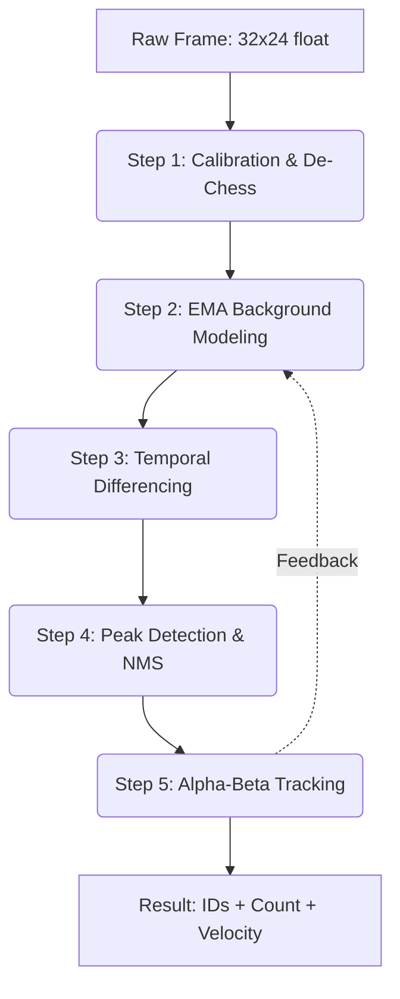

# Thermal Pipeline: Processing Stages

The `ThermalPipeline` component is the mathematical heart of the project. It transforms a low-resolution infrared matrix (32x24) into discretized movement vectors and counting events.

## 🌊 Pipeline Flowchart

## 🛠 Stage Breakdown

### 1. Spatial Filtering (De-Chess)
The MLX90640 sensor has a native noise pattern caused by the interleaved reading order of its sub-pages.
- **Logic**: We apply a 3x3 kernel that detects "checkerboard" shifts and smooths them using a weighted neighbor average.
- **Result**: A clean image that preserves thermal edges but removes digital artifacts.

### 2. Selective EMA Background Learning
We maintain a "running model" of what the floor/room temperature looks like.
- **Selective Learning**: If a pixel is identified as part of a "Person Track", the background model **stops learning** for that pixel. This prevents a person who stops moving from being absorbed into the background.

### 3. Non-Maximum Suppression (NMS)
Since humans occupy multiple pixels, a single head might generate 3 or 4 local maxima.
- **Logic**: For every pixel above the threshold, we check its neighbors within a `config.nms_radius`. If a hotter neighbor exists, the current pixel is discarded.
- **Result**: One single point (Centroid) per person.

### 4. Alpha-Beta Tracking
We use a lightweight state estimator (simpler than a full Kalman filter for the ESP32) to track these centroids over time.
- **Parameters**: `Alpha` (position update) and `Beta` (velocity update).
- **Consistency**: The system assigns a persistent `ID` to each person. If they move towards a counting line, the cumulative velocity determines if they are crossing with "Intent" or just hovering.

---

> [!TIP]
> **Performance Optimization**: All loops are optimized to minimize branching, allowing the math to fit within the 62.5ms window required for 16 FPS.
