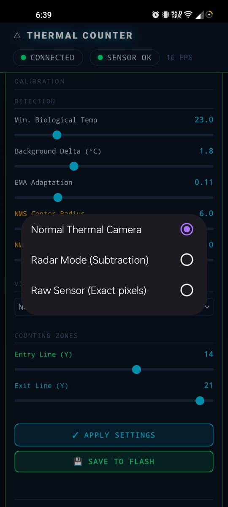
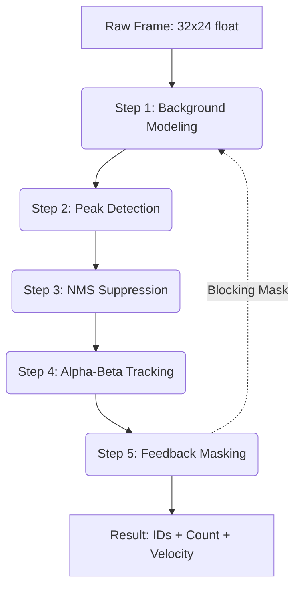

# Thermal Pipeline: Processing Stages

The `ThermalPipeline` component is the mathematical heart of the project. It transforms a low-resolution infrared matrix (32x24) into discretized movement vectors and counting events.
- **Masking**: Temporary suppression of the zone where a target was just counted to avoid double counting on re-entry.

## 🌊 Pipeline Flowchart

## 🛠 Stage Breakdown

### 1. Adaptive Background Modeling
We maintain a "running model" of what the floor/room temperature looks like using Exponential Moving Average.
- **Selective Learning**: If a pixel is inside a "Feedback Mask" (near a target), the model **stops learning** for that pixel. This prevents people from disappearing when static.

### 2. Peak Detection (Thermal Topology)
Analyzes the difference between the live frame and the background model. Finds local maxima that exceed both `BIOLOGICAL_TEMP_MIN` and `BACKGROUND_DELTA_T`.

### 3. Non-Maximum Suppression (NMS)
Since humans occupy multiple pixels, a single head might generate multiple peaks.
- **Logic**: For every peak, we check its neighbors within a `config.nms_radius`. Redundant peaks are suppressed.

### 4. Alpha-Beta Tracking
We use a lightweight state estimator to follow centroids over time.
- **Identity**: Assigns persistent IDs.
- **Anti-Stealing**: Prevents nearby tracks from swapping IDs mistakenly.

### 5. Feedback Masking
Generates a binary mask around active tracks. This mask is fed back into Stage 1 to freeze background adaptation.

---

> [!TIP]
> **Performance Optimization**: All stages are optimized for ESP32-S3 AVX-like instructions and floating-point acceleration, meeting the 16 Hz real-time requirement.
