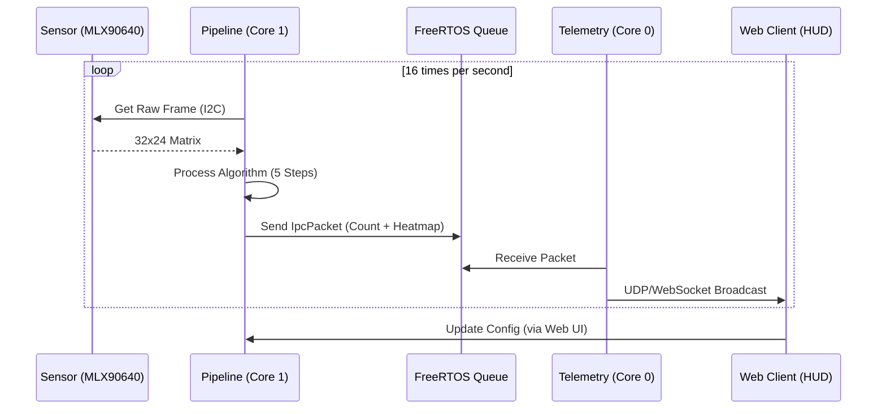

# System Design: Internal Concurrency & Data Flow

This document details the internal architecture of the Thermal People Counter, focusing on how it leverages the ESP32-S3's dual-core capabilities and FreeRTOS primitives for deterministic performance.

## 🧵 Concurrency Model

The system operates two primary tasks pinned to different CPU cores to prevent network overhead from interfering with time-critical vision processing.

### Task Table

| Task Name | Core | Priority | Stack Size | Responsibility |
|-----------|------|----------|------------|----------------|
| `ThermalPipe` | 1 (APP) | 24 (Max) | 6 KB (Static) | Non-blocking Sensor reading & Vision processing |
| `TelemetryTX` | 0 (PRO) | 2 | 3.5 KB (Static) | UDP Broadcast & WebSocket streaming |
| `HTTP Server` | 0 (PRO) | 5 | 16 KB | Handling Web Panel, API & Binary HUD |

## 🔄 Lifecycle Diagram

## 🧠 Memory Management Strategy

To ensure long-term stability in industrial/continuous environments, the system strictly follows a **Static Allocation Policy**:

1. **Static Task Buffers**: Task stacks and TCBs are pre-allocated at compile time using `xTaskCreateStatic`.
2. **Static Queues**: Communication buffers between cores are fixed size and statically allocated.
3. **No `new` or `malloc` in Loops**: Dynamic memory is only used during initialization (`app_main`). Once the system is running, the heap remains untouched.

### Why this matters?
The MLX90640 driver performs heavy floating-point math. By isolating this on Core 1 and using static memory, we eliminate the risk of "Task Starvation" or "Heap Fragmentation" causing unpredictable resets during critical counting windows.
