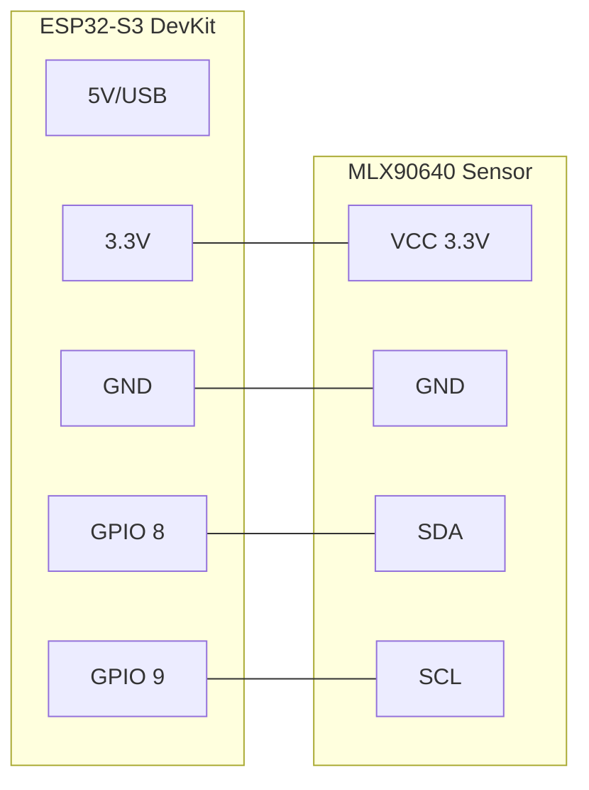

# Hardware: Esquema de Conexiones y Pines

## 1. Sensor MLX90640 (Termopila)

Este sistema basa## 🔌 Esquema de Conexión (Pinout)

El sistema utiliza el bus I2C para la comunicación con el sensor MLX90640. El ESP32-S3 se encarga de la alimentación y procesamiento.

### Diagrama de Cableado

### Requerimientos de Energía
- **Voltaje**: 3.3V estable (el sensor es sensible a fluctuaciones).
- **Consumo Pico**: 150mA (durante transmisión WiFi). Se recomienda un capacitor de desacople de **100nF + 10uF** entre VCC y GND cerca del sensor si los cables son largos (>15cm).

---
 su percepción espacial en una matriz de 768 píxeles. El sensor se comunica puramente por **I2C**.

| Pin Sensor | Pin ESP32-S3 | Rol | Notas Críticas |
| :--- | :--- | :--- | :--- |
| `VCC` | `3.3V` | Energía | Asegurar regulador LDO estable. Picos de 23mA. |
| `GND` | `GND` | Tierra | Conexión corta al microcontrolador. |
| `SDA` | `GPIO 8` | Datos (I2C) | Resistencias Pull-Up de 2.2kΩ - 4.7kΩ obligatorias si el módulo no las trae. |
| `SCL` | `GPIO 9` | Reloj (I2C) | Configurado a 400kHz (Fast Mode) o 1MHz (Fast Mode Plus). |

## 2. Telemetría a Receptor Separado (Comunicación Lógica)
Actualmente, todo va embebido en el ESP32, pero el Core 0 de este sistema empuja paquetes de telemetría UDP a un segundo ESP32 (si existe).

| IP Creador (SoftAP) | Puerto UDP Emisor | Rol en Sistema | Destino (Dispositivo 2) |
| :--- | :--- | :--- | :--- |
| `192.168.4.1` | `4210` | Envío de Paquetes RAW y Counts | `192.168.4.255:4210` (Broadcast) |

## 3. Extensiones SD y RTC (Futuras)

De requerirse grabación a SD, los módulos se anexan de la siguiente manera:

*   **Reloj RTC (DS3231)**: Se colgará del mismo bus **SDA (GPIO 8)** y **SCL (GPIO 9)**. Posee otra dirección esclava (`0x68`) y responderá independientemente de la cámara térmica.
*   **Adaptador MicroSD (SPI)**: Usará preferiblemente los buses digitales nativos del S3, por ejemplo `MISO: 19, MOSI: 23, SCK: 18, CS: 32`.

### Regla de Oro (Strapping Pins)
**Bajo ninguna circunstancia** utilice los pines `GPIO 0, 2, 5, 12, 15` para cablear sensores Lógicos (High/Low) que puedan mantener estado durante el arranque. Causa Bootloops del chip Espressif completos.
