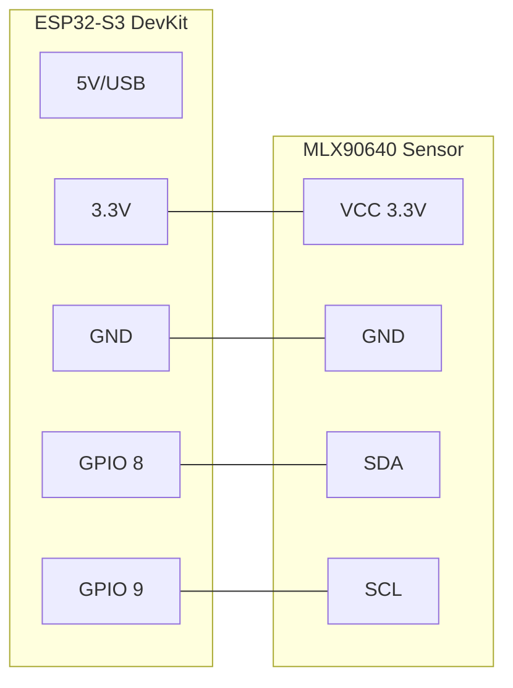

# Hardware: Pinout and Connections

## 🔌 Connection Diagram (Pinout)

The system uses the I2C bus for communication with the MLX90640 sensor. The ESP32-S3 handles power and processing.

### Wiring Diagram

### Power Requirements
- **Voltage**: Stable 3.3V (the sensor is sensitive to fluctuations).
- **Peak Consumption**: 150mA (during WiFi transmission). A decoupling capacitor of **100nF + 10uF** between VCC and GND near the sensor is recommended if cables are long (>15cm).

---

The system bases its spatial perception on a 768-pixel matrix. The sensor communicates purely via **I2C**.

| Sensor Pin | ESP32-S3 Pin | Role | Critical Notes |
| :--- | :--- | :--- | :--- |
| `VCC` | `3.3V` | Power | Ensure a stable LDO regulator. 23mA peaks. |
| `GND` | `GND` | Ground | Short connection to the microcontroller. |
| `SDA` | `GPIO 8` | Data (I2C) | 2.2kΩ - 4.7kΩ Pull-up resistors mandatory if the module lacks them. |
| `SCL` | `GPIO 9` | Clock (I2C) | Configured at 400kHz (Fast Mode) or 1MHz (Fast Mode Plus). |

## 2. Telemetry to Separate Receiver (Logical Communication)
Currently, everything is embedded in the ESP32, but Core 0 of this system pushes UDP telemetry packets to a second ESP32 (if one exists).

| Producer IP (SoftAP) | Sender UDP Port | System Role | Destination (Device 2) |
| :--- | :--- | :--- | :--- |
| `192.168.4.1` | `4210` | Sending RAW packets and Counts | `192.168.4.255:4210` (Broadcast) |

## 3. SD and RTC Extensions (Future)

If SD recording is required, the modules are attached as follows:

*   **RTC Clock (DS3231)**: Will hang from the same **SDA (GPIO 8)** and **SCL (GPIO 9)** bus. It has another slave address (`0x68`) and will respond independently of the thermal camera.
*   **MicroSD Adapter (SPI)**: Will preferably use the S3's native digital buses, for example `MISO: 19, MOSI: 23, SCK: 18, CS: 32`.

### Golden Rule (Strapping Pins)
**Under no circumstances** use pins `GPIO 0, 2, 5, 12, 15` to wire logic sensors (High/Low) that can maintain state during boot. This causes complete Espressif chip bootloops.
