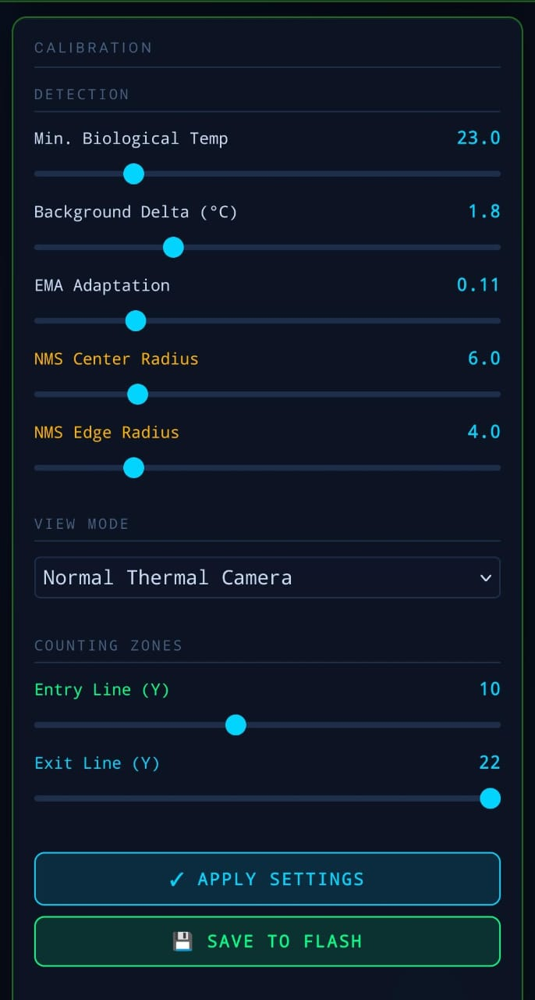

# Thermal Calibration Guide — Operations

The system provides an "In-Situ" interface hosted at `http://192.168.4.1/`. From there, critical thermal parameters must be calibrated after physical installation to ensure accurate detection and zero false positives.

## Tuning Procedure

1. **Top-Down Mounting:** Verify the camera points to the floor and that no air conditioners are blowing hot/cold air directly onto the lens.
2. **UI Access:** Connect with a smartphone to the `ThermalCounter` Wi-Fi network and open the browser at `192.168.4.1`. Default password: `counter1234`.

### Critical Parameters

A. **Biological Temp:** Threshold temperature below which **everything** is considered inert floor. If the environment is very cold (Winter), you can lower this to `21.0f`. If it's a heavy summer (30°C ambient), raise it to `28.0f`.
B. **Background Delta:** Mandatory degrees Celsius above the floor (background). The moving average (EMA) algorithm will learn residual heat from a heater if it doesn't move for 10 minutes. This value ensures a transient human breaks the dynamic background. (Recommended: `1.5` to `2.5`).
C. **NMS Radius:** Spatial thermal cluster filter. If you install the sensor on a very low ceiling (e.g., 2.5 meters), a human will look "huge" and the NMS radius must be higher. If the ceiling is very high (4.5 meters), thermal heads measure about 2 pixels; here, the NMS Radius should be minimal (1 or 2).

3. Click **APPLY SETTINGS** to test live.
4. Click **SAVE TO FLASH** to make the configuration permanent.

### Closing
Once you observe smooth crossings in the Dashboard under "Raw Peaks" (and their corresponding yellow vector arrows), the values are no longer volatile and persist through power outages (NVS Save).
